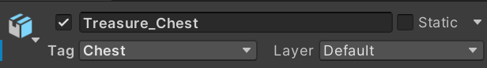
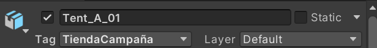
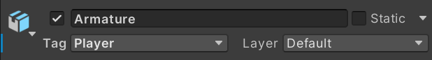
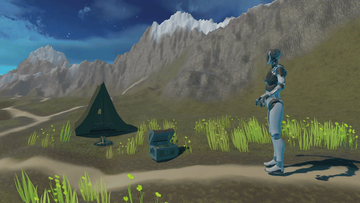

# Interfaces Inteligentes
## Introducción a Unity

### Analicemos los componentes de este proyecto:
- **Terreno**
  * Terreno montañoso hecho con pincel que levanta (o baja) el terreno
  * Y con el pincel de añadir textura se le añadió el color a todo por capas
  * También se añadieron objetos básicos como hierba y flores
- **Starter Assets - Third Pperson**
  * Se descargó el `Starter Asset` de tercera persona y se añadió al personaje
- **Objetos 3D**
  * De descargaron varios *Assets*, incluyendo el `POLY - Lite Survival Collection`, que contiene
    objetos como la tienda de campaña y fogata y `3D Props - Chest Object`, que contiene el cofre del tesoro
- **Cielo**
  * El cielo también es un asset que permite insertar un `skybox` personalizado

### Tags

Cada objeto contiene su propia etiqueta






### Script

```cs
using System.Collections;
using System.Collections.Generic;
using UnityEngine;

public class Position : MonoBehaviour {
  public GameObject[] objects;
  // Start is called before the first frame update
  void Start() {
    foreach (GameObject obj in objects) {
        Vector3 position = obj.transform.position;
        Debug.Log(obj.name + " está en la posición: " + position);
    }
  }

  // Update is called once per frame
  void Update() {
        
  }
}
```
1. Crea un array para almacenar todos los objetos (estos se añaden a través de la ventana del inspector)
2. Recorre el array y para cada elemento, obtiene su posición con `obj.transform.position` y lo imprime por la consola

### Producto final


